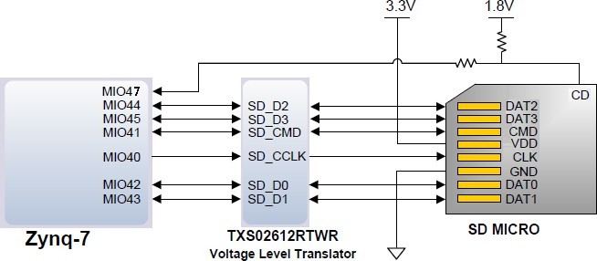

黑金基于 XILINX ZYNQ7000 开发平台的开发板 2016款正式发布了，型号为：AX7010 。此款开发平台是 XILINX 的 Zynq7000 SOC
芯片的解决方案。它采用 ARM+FPGA SOC 技术将双核 ARM Cortex-A9 和 FPGA可编程逻辑集成在一颗芯片上。它采用的是 Xilinx 的Zynq7000 系列
XC7Z010-1CLG400C 作为核心处理器，在 ARM 和 FPGA上分别具有丰富的硬件资源和外围接口。设计上坚持“精致、实用、简洁”的设计理念，它不但适合于软件工作人员的前期的软件验证，也适合于硬件开发人员的硬件设计即软硬件的系统协作，加快项目的开发进程。

    
图 1-1 ZYNQ 开发板全貌

开发板简介
===========

在这里，对这款 ZYNQ7000 开发平台 AX7010 进行简单的功能介绍。
此款开发板使用的是Xilinx 公司的Zynq7000系列的芯片，型号为XC7Z010-1CLG400C， 400 个引脚的 FBGA 封装。ZYNQ7000芯片可分成处理器系统部分 Processor System（PS） 和可编程逻辑部分
Programmable Logic（PL）。在 AX7010 开发板上，ZYNQ7000 的 PS部分和 PL部分都搭载了丰富的外部接口和设备，方便用户的使用和功能验证。
另外开发板上集成了Xilinx USB Cable 下载器电路，用户只要用一个 USB线就可以对开发板进行下载和调试。图 1-2 为整个 AX7010
整个系统的结构示意图：

    
图 1-2 AX7010 结构示意图

通过这个示意图，我们可以看到，我们这个开发平台所能含有的接口和功能。

 +5V 电源输入,最大 2A 电流保护；

-  Xilinx ARM+FPGA 芯片 Zynq-7000 XC7Z010-1CLG400C

-  两片大容量的 2Gbit（共 4Gbit）高速 DDR3 SDRAM,可作为 ZYNQ
   芯片数据的缓存， 也可以作为操作系统运行的内存;

-  一片 256Mbit 的 QSPI FLASH, 可用作 ZYNQ
   芯片的系统文件和用户数据的存储;

-  一路10/100M/1000M 以太网RJ-45 接口,
   可用于和电脑或其它网络设备进行以太网数据交换;

-  一路 HDMI 图像视频输入输出接口, 能实现 1080P 的视频图像传输；

-  一路高速 USB2.0 HOST 接口, 可用于开发板连接鼠标、键盘和 U 盘等 USB
   外设;

-  一路高速 USB2.0 OTG 接口, 用于和 PC 或 USB 设备的 OTG 通信;

-  一路 USB Uart 接口, 用于和 PC 或外部设备的串口通信;

-  一片的 RTC 实时时钟，配有电池座，电池的型号为 CR1220。

-  一片 IIC 接口的 EEPROM 24LC04;

-  6 个用户发光二极管 LED, 2 个 PS 控制，4 个 PL 控制;

-  7 个按键，1 个 CPU 复位按键，2 个 PS 控制按键，4 个 PL 控制按键；

-  板载一个 33.333Mhz 的有源晶振，给 PS 系统提供稳定的时钟源，一个 50MHz
   的有源晶振，为 PL 逻辑提供额外的时钟；

-  2 路 40 针的扩展口（2.54mm 间距），用于扩展 ZYNQ 的 PL 部分的
   IO。可以接 7寸 TFT 模块、摄像头模块和 AD/DA 模块等扩展模块；

-  一个 12 针的扩展口（2.54mm 间距），用于扩展 ZYNQ 的 PS 系统的 MIO；

-  一路 USB JTAG 口，通过 USB 线及板载的 JTAG 电路对 ZYNQ
   系统进行调试和下载。1 路 Micro SD
   卡座(开发板背面），用于存储操作系统镜像和文件系统。

结构尺寸
=============

|image1|

开发板的尺寸为精简的 130mm x 90mm, PCB 采用 8层板设计。板子四周有 4 个螺丝定位孔，用于固定开发板，定位孔的孔径为
3.5mm(直径），资料中提供 dxf 结构图。

电源
=========

电源输入：开发板供电电压为DC5V，请使用开发板自带的电源,不要用其他规格的电源，以免损坏开发板。开发板上的电源设计示意图如下:

|image2|\ |image3|\ |image4|

图 3-1 原理图中电源接口部分

开发板通过+5V 供电, 通过四路 DC/DC 电源芯片 TLV62130RGT转化成+3.3V，+1.5V，+1.8V，+1.0V 四路电源， 每路输出电流可高达 3A。通过一路 LDO
SPX3819M5-3-3 产生VCCIO 电源，VCCIO 最要是针对 ZYNQ 的 BANK35进行供电，通过更换其它的 LDO 芯片， 使得 BANK35 的IO
适应不同的电压标准。1.5V 通过TI 的 TPS51200 生成DDR3 需要的VTT 和VREF 电压。各个电源分配的功能如下表所示：

+--------------+-------------------------------------------------------+
| **电源**     | **功能**                                              |
+--------------+-------------------------------------------------------+
| +3.3V        |    ZYNQ VCCIO, 以太网，串口，HDMI, RTC，              |
|              |                                                       |
|              | FLASH, EEPROM 以及 SD card                            |
+--------------+-------------------------------------------------------+
| +1.8V        |    ZYNQ 辅助电压, ZYNQ PLL, ZYNQ Bank501              |
|              |                                                       |
|              | VCCIO, 以太网，USB2.0                                 |
+--------------+-------------------------------------------------------+
| +1.0V        |    ZYNQ,的核心电压                                    |
+--------------+-------------------------------------------------------+
| +1.5V        |    DDR3, ZYNQ Bank502                                 |
+--------------+-------------------------------------------------------+
| VREF, VTT    |    DDR3                                               |
+--------------+-------------------------------------------------------+
| VCCIO        |    ZYNQ Bank35                                        |
+--------------+-------------------------------------------------------+

..

因为 ZYNQ 的 PS 和 PL部分的电源有上电顺序的要求，在电路设计中，我们已经按照ZYQN的电源要求设计，上电依次为 1.0V -> 1.8V -> 1.5 V -> 3.3V -> VCCIO，图3-2 为电源的电路设计：

|image5|

图3-2 开发板的电源设计

我们在设计 PCB 的时候，采用 8 层 PCB，预留了独立的电源层和 GND层，使得整个开发板的电源，具有非常好的稳定性。在 PCB板上我们预留了各个电源的测试点，以便用户确认板上的电压。

    
图 3-3 实物图中的电源测试点

ZYNQ7000
=============

开发板使用的是 Xilinx 公司的 Zynq7000 系列的芯片，型号为XC7Z010-1CLG400C。芯片的 PS 系统集成了两个 ARM Cortex™-A9处理器，AMBA➅互连，内部存储器，外部存储器接口和外设。这些外设主要包括USB 总线接口，以太网接口，SD/SDIO 接口，I2C 总线接口，CAN
总线接口，UART 接口，GPIO 等。PS可以独立运行并在上电或复位下启动。ZYNQ7000 芯片的总体框图如图 4-1所示

.. image:: images/media/image11.jpeg
    
图4-1 ZYNQ7000芯片的总体框图其中 PS 系统部分的主要参数如下：

-  基于 ARM 双核 CortexA9 的应用处理器

-  每个 CPU 32KB 1 级指令和数据缓存，512KB 2 级缓存 2 个 CPU 共享

-  片上 boot ROM 和 256KB 片内 RAM

-  外部存储接口，支持 16/32 bit DDR2、DDR3 接口

-  两个千兆网卡支持：发散-聚集 DMA ，GMII，RGMII，SGMII 接口

-  两个 USB2.0 OTG 接口，每个最多支持 12 节点

-  两个 CAN2.0B 总线接口

-  两个 SD 卡、SDIO、MMC 兼容控制器

-  2 个 SPI，2 个 UARTs，2 个 I2C 接口

-  4 组 32bit GPIO，54（32+22）作为 PS 系统 IO，64 连接到 PL

-  PS 内和 PS 到 PL 的高带宽连接

..

其中 PL 逻辑部分的主要参数如下：

-  逻辑单元 Logic Cells：28K；

-  查找表 LUTs:17600

-  触发器(flip-flops):35200

-  乘法器 18x25MACCs：80;

-  Block RAM：2.1Mb；

-  两个 AD 转换器,可以测量片上电压、温度感应和高达 17
   外部差分输入通道，1MBPS

..

XC7Z010-1CLG400C 芯片为 BGA 封装，400 个引脚，引脚间距为 0.8mm。再次说明一下 BGA 管脚，当我们使用 BGA封装的芯片以后，引脚名称变为由\ **字母+数字**\ 的形式，比如E3，G3
等等，因此我们在看原理图的时候，看到的\ **字母+数字**\ 这种形式的，就是代表了BGA 的引脚。

    
图4-2 XC7Z010芯片实物

JTAG 接口
---------

首先我们来说 AX7010 开发板的 JTAG 调试接口,在电路板上已经集成了 JTAG 的下载调试电路，所以用户无需购买额外的Xilinx 下载器。只要一根 USB 线就能进行 ZYNQ 的开发和调试了。在 AX7010
开发板上通过一个 FTDI 的 USB 桥接芯片 FT232HL 实现 PC 的 USB 和ZYNQ的 JTAG 调试信号 TCK,TDO,TMS,TDI 进行数据通信。图 4-3 为开发板上 JTAG口的原理图部分：

|image6|

图4-3 原理图中JTAG接口部分

在 AX7010 开发板上，JTAG 接口的形式是 USB接口方式的，用户可以通过我们提供的USB 线连接 PC 和 JTAG 接口进行 ZYNQ
的系统调试。

.. image:: images/media/image14.jpeg
    
图4-4 JTAG接口实物图

FPGA 供电系统
-------------
接下来，我们说一下 AX7010 的电源设计部分。ZYNQ 芯片的电源分 PS系统部分和 PL 逻辑部分，两部分的电源分别是独立工作。PS系统部分的电源和 PL
逻辑部分的电源都有上电顺序，不正常的上电顺序可能会导致 ARM 系统和FPGA 系统无法正常工作。
PS 部分的电源有 VCCPINT、VCCPAUX、VCCPLL 和PS VCCO。VCCPINT 为 PS内核供电引脚，接 1.0V；VCCPAUX 为 PS 系统辅助供电引脚，接 1.8V；VCCPLL 为
PS 的内部时钟PLL 的电源供电引脚，也接 1.8V；PS VCCO 为 BANK的电压，包含 VCCO_MIO0，VCCO_MIO1和VCCO_DDR，根据连接的外设不同，连接的电源电源也会不同，在 AX7010
开发板上， VCC_MIO0 连接 3.3V， VCCO_MIO1 连接 1.8V，VCCO_DDR 连接1.5V。PS 系统要求上电顺序分别为先 VCCPINT 供电，然后 VCCPAUX 和
VCCPLL，最后为 PS VCCO。断电的顺序则相反。

PL 部分的电源有 VCCINT, VCCBRAM, VCCAUX 和 VCCO。VCCPINT 为 FPGA内核供电引脚，接 1.0V；VCCBRAM 为 FPGA Block RAM 的供电引脚；接
1.0V；VCCAUX 为 FPGA 辅助供电引脚, 接 1.8V；VCCO 为 PL 的各个 BANK的电压，包含 BANK13，BANK34， BANK35，在 AX7010 开发板上，BANK
的电压连接 3.3V。PL 系统要求上电顺序分别为先VCCINT 供电，再是 VCCBRAM, 然后是VCCAUX，最后为 VCCO。如果 VCCINT和VCCBRAM的电压一样，可以同时上电。断电的顺序则相反。

ZYNQ 启动配置
-------------

AX7010 开发平台支持三种启动模式。这三种启动模式分别是 JTAG调试模式,QSPI FLASH 和 SD 卡启动模式。ZYNQ702 芯片上电后会检测响应
MIO 口的电平来决定那种启动模式。用户可以通过核心板上的 J13的跳线来选择不同的启动模式。J13 启动模式配置如下表4-1 所示。

+-------------------------+---------------------+---------------------+
|    **J13**              |    **跳帽位置**     |    **启动模式**     |
+-------------------------+---------------------+---------------------+
| |image7|                |    连接左边两个引脚 |    SD Card          |
+-------------------------+---------------------+---------------------+
|                         |    连接中间两个引脚 |    QSPI FLASH       |
+-------------------------+---------------------+---------------------+
|                         | 连接右边边两个引脚  |    JTAG             |
+-------------------------+---------------------+---------------------+

..

表4-1 J13启动模式配置

时钟配置
=============

AX7010 开发板上分别为 PS 系统和 PL 逻辑部分提供了有源时钟，是 PS系统和 PL 逻辑可以单独工作。

PS 系统时钟源
-------------

ZYNQ 芯片通过开发板上的 X1 晶振为 PS 部分提供 33.333MHz的时钟输入。时钟的输入连接到 ZYNQ 芯片的 BANK500 的 PS_CLK_500的管脚上。其原理图如图 5-1 所示：

图5-1 PS部分的有源晶振

图 5-2 为有源晶振实物图 

    
图5-2 33.333Mhz有源晶振实物图

**时钟引脚分配：**

+-----------------------------------+-----------------------------------+
|    **信号名称**                   |    **ZYNQ 引脚**                  |
+-----------------------------------+-----------------------------------+
|    **PS_CLK_500**                 |    **E7**                         |
+-----------------------------------+-----------------------------------+

PL 系统时钟源
-------------

AX7010 开发板上提供了单端 50MHz 的 PL 系统时钟源，3.3V供电。晶振输出连接到FPGA 的全局时钟(MRCC)，这个 GCLK 可以用来驱动FPGA 内的用户逻辑电路。该时钟源的原理图如图 5-3 所示

    
图 5-3 PL系统时钟源图 5-4 为有源晶振 50MHz 的实物图

          
图5-4 50Mhz有源晶振实物图

**PL 时钟引脚分配：**

+-----------------------------------+-----------------------------------+
|    **信号名称**                   |    **ZYNQ 引脚**                  |
+-----------------------------------+-----------------------------------+
|    **PL_GCLK**                    |    **U18**                        |
+-----------------------------------+-----------------------------------+

PS 端的外设
================

因为 ZYNQ 是由 ARM 系统 PS 部分和 FPGA 逻辑 PL部分组成，开发板上有些外设是连接到 PS 的 IO上，有些外设是连接到开发板的 PL 的 IO 上。首先我们先对 PS
部分连接的外设做介绍。

QSPI Flash
----------

开发板配有一片 256MBit 大小的 Quad-SPI FLASH 芯片，型号为W25Q256，它使用3.3V CMOS 电压标准。由于 QSPI FLASH的非易失特性，在使用中，
它可以作为系统的启动设备来存储系统的启动镜像。这些镜像主要包括 FPGA的 bit 文件、ARM 的应用程序代码以及其它的用户数据文件。QSPI FLASH
的具体型号和相关参数见表 6-1。

+--------------+--------------------+------------------+--------------+
| **位号**     |    **芯片类型**    |    **容量**      |    **厂家**  |
+--------------+--------------------+------------------+--------------+
| U15          |    W25Q256BV       |    32M Byte      |    Winbond   |
+--------------+--------------------+------------------+--------------+

..

表6-1 QSPI Flash的型号和参数

QSPI FLASH 连接到 ZYNQ 芯片的 PS 部分 BANK500 的 GPIO口上，在系统设计中需要配置这些 PS 端的 GPIO 口功能为 QSPI FLASH接口。为图 6-1 为 QSPI Flash 在硬件连接示意图。

    
图6-1 QSPI Flash连接示意图

**配置芯片引脚分配：**

+-----------------------------+------------------+---------------------+
|    **信号名称**             |    **ZYNQ        |    **ZYNQ 引脚号**  |
|                             |    引脚名**      |                     |
+-----------------------------+------------------+---------------------+
|    **QSPI_CLK**             |    PS_MIO6_500   |    A5               |
+-----------------------------+------------------+---------------------+
|    **QSPI_CS**              |    PS_MIO1_500   |    A7               |
+-----------------------------+------------------+---------------------+
|    **QSPI_D0**              |    PS_MIO2_500   |    B8               |
+-----------------------------+------------------+---------------------+
|    **QSPI_D1**              |    PS_MIO3_500   |    D6               |
+-----------------------------+------------------+---------------------+
|    **QSPI_D2**              |    PS_MIO4_500   |    B7               |
+-----------------------------+------------------+---------------------+
|    **QSPI_D3**              |    PS_MIO5_500   |    A6               |
+-----------------------------+------------------+---------------------+

DDR3 DRAM
---------

AX7010开发板上配有两个SKHynix(海力士）的2Gbit（512MB）的DDR3芯片(共计4Gbit),
型号为H5TQ2G63FFR（兼容MT41J128M16HA-125）。DDR的总线宽度共为32bit。DDR3SDRAM的最高运行速度可达533MHz(数据速率1066Mbps)。该DDR3存储系统直接连接到了ZYNQ处理系统（PS）的BANK502的存储器接口上。DDR3 SDRAM的具体配置如下表6-1 所示。

表6-1 DDR3 SDRAM配置

+--------------+--------------------+------------------+--------------+
|    **位号**  |    **芯片类型**    |    **容量**      |    **厂家**  |
+--------------+--------------------+------------------+--------------+
|    U8,U9     | H5TQ2G63FFR-RDC    |    128M x 16bit  |    SKHynix   |
+--------------+--------------------+------------------+--------------+

DDR3 的硬件设计需要严格考虑信号完整性，我们在电路设计和 PCB设计的时候已经充分考虑了匹配电阻/终端电阻,走线阻抗控制，走线等长控制，
保证 DDR3 的高速稳定的工作。

|image8|\ DDR3 DRAM 的硬件连接示意图如图 6-2 所示:

图6-2 DDR3 DRAM原理图部分图 6-3 为 DDR3 DRAM 实物图

    
图 6-3 DDR3 DRAM 实物图

**DDR3 DRAM 引脚分配：**

+-----------------------+---------------------+------------------------+
|    **信号名称**       | **ZYNQ 引脚名**     |    **ZYNQ 引脚号**     |
+-----------------------+---------------------+------------------------+
|    **DDR3_DQS0_P**    | PS_DDR_DQS_P0_502   |    C2                  |
+-----------------------+---------------------+------------------------+
|    **DDR3_DQS0_N**    | PS_DDR_DQS_N0_502   |    B2                  |
+-----------------------+---------------------+------------------------+
|    **DDR3_DQS1_P**    | PS_DDR_DQS_P1_502   |    G2                  |
+-----------------------+---------------------+------------------------+
|    **DDR3_DQS1_N**    | PS_DDR_DQS_N1_502   |    F2                  |
+-----------------------+---------------------+------------------------+
|    **DDR3_DQS2_P**    | PS_DDR_DQS_P2_502   |    R2                  |
+-----------------------+---------------------+------------------------+
|    **DDR3_DQS2_N**    | PS_DDR_DQS_N2_502   |    T2                  |
+-----------------------+---------------------+------------------------+
|    **DDR3_DQS3_P**    | PS_DDR_DQS_P3_502   |    W5                  |
+-----------------------+---------------------+------------------------+
|    **DDR3_DQS4_N**    | PS_DDR_DQS_N3_502   |    W4                  |
+-----------------------+---------------------+------------------------+
|    **DDR3_DQ[0]**     | PS_DDR_DQ0_502      |    C3                  |
+-----------------------+---------------------+------------------------+
|    **DDR3_DQ [1]**    | PS_DDR_DQ1_502      |    B3                  |
+-----------------------+---------------------+------------------------+
|    **DDR3_DQ [2]**    | PS_DDR_DQ2_502      |    A2                  |
+-----------------------+---------------------+------------------------+
|    **DDR3_DQ [3]**    | PS_DDR_DQ3_502      |    A4                  |
+-----------------------+---------------------+------------------------+
|    **DDR3_DQ [4]**    | PS_DDR_DQ4_502      |    D3                  |
+-----------------------+---------------------+------------------------+
|    **DDR3_DQ [5]**    | PS_DDR_DQ5_502      |    D1                  |
+-----------------------+---------------------+------------------------+

+-----------------------+---------------------+------------------------+
|    **DDR3_DQ [6]**    | PS_DDR_DQ6_502      |    C1                  |
+-----------------------+---------------------+------------------------+
|    **DDR3_DQ [7]**    | PS_DDR_DQ7_502      |    E1                  |
+-----------------------+---------------------+------------------------+
|    **DDR3_DQ [8]**    | PS_DDR_DQ8_502      |    E2                  |
+-----------------------+---------------------+------------------------+
|    **DDR3_DQ [9]**    | PS_DDR_DQ9_502      |    E3                  |
+-----------------------+---------------------+------------------------+
|    **DDR3_DQ [10]**   | PS_DDR_DQ10_502     |    G3                  |
+-----------------------+---------------------+------------------------+
|    **DDR3_DQ [11]**   | PS_DDR_DQ11_502     |    H3                  |
+-----------------------+---------------------+------------------------+
|    **DDR3_DQ [12]**   | PS_DDR_DQ12_502     |    J3                  |
+-----------------------+---------------------+------------------------+
|    **DDR3_DQ [13]**   | PS_DDR_DQ13_502     |    H2                  |
+-----------------------+---------------------+------------------------+
|    **DDR3_DQ [14]**   | PS_DDR_DQ14_502     |    H1                  |
+-----------------------+---------------------+------------------------+
|    **DDR3_DQ [15]**   | PS_DDR_DQ15_502     |    J1                  |
+-----------------------+---------------------+------------------------+
|    **DDR3_DQ [16]**   | PS_DDR_DQ16_502     |    P1                  |
+-----------------------+---------------------+------------------------+
|    **DDR3_DQ [17]**   | PS_DDR_DQ17_502     |    P3                  |
+-----------------------+---------------------+------------------------+
|    **DDR3_DQ [18]**   | PS_DDR_DQ18_502     |    R3                  |
+-----------------------+---------------------+------------------------+
|    **DDR3_DQ [19]**   | PS_DDR_DQ19_502     |    R1                  |
+-----------------------+---------------------+------------------------+
|    **DDR3_DQ [20]**   | PS_DDR_DQ20_502     |    T4                  |
+-----------------------+---------------------+------------------------+
|    **DDR3_DQ [21]**   | PS_DDR_DQ21_502     |    U4                  |
+-----------------------+---------------------+------------------------+
|    **DDR3_DQ [22]**   | PS_DDR_DQ22_502     |    U2                  |
+-----------------------+---------------------+------------------------+
|    **DDR3_DQ [23]**   | PS_DDR_DQ23_502     |    U3                  |
+-----------------------+---------------------+------------------------+
|    **DDR3_DQ [24]**   | PS_DDR_DQ24_502     |    V1                  |
+-----------------------+---------------------+------------------------+
|    **DDR3_DQ [25]**   | PS_DDR_DQ25_502     |    Y3                  |
+-----------------------+---------------------+------------------------+
|    **DDR3_DQ [26]**   | PS_DDR_DQ26_502     |    W1                  |
+-----------------------+---------------------+------------------------+
|    **DDR3_DQ [27]**   | PS_DDR_DQ27_502     |    Y4                  |
+-----------------------+---------------------+------------------------+
|    **DDR3_DQ [28]**   | PS_DDR_DQ28_502     |    Y2                  |
+-----------------------+---------------------+------------------------+
|    **DDR3_DQ [29]**   | PS_DDR_DQ29_502     |    W3                  |
+-----------------------+---------------------+------------------------+
|    **DDR3_DQ [30]**   | PS_DDR_DQ30_502     |    V2                  |
+-----------------------+---------------------+------------------------+
|    **DDR3_DQ [31]**   | PS_DDR_DQ31_502     |    V3                  |
+-----------------------+---------------------+------------------------+
|    **DDR3_DM0**       | PS_DDR_DM0_502      |    A1                  |
+-----------------------+---------------------+------------------------+
|    **DDR3_DM1**       | PS_DDR_DM1_502      |    F1                  |
+-----------------------+---------------------+------------------------+
|    **DDR3_DM2**       | PS_DDR_DM2_502      |    T1                  |
+-----------------------+---------------------+------------------------+
|    **DDR3_DM3**       | PS_DDR_DM3_502      |    Y1                  |
+-----------------------+---------------------+------------------------+
|    **DDR3_A[0]**      | PS_DDR_A0_502       |    N2                  |
+-----------------------+---------------------+------------------------+
|    **DDR3_A[1]**      | PS_DDR_A1_502       |    K2                  |
+-----------------------+---------------------+------------------------+

+-----------------------+---------------------+------------------------+
|    **DDR3_A[2]**      |    PS_DDR_A2_502    |    M3                  |
+-----------------------+---------------------+------------------------+
|    **DDR3_A[3]**      |    PS_DDR_A3_502    |    K3                  |
+-----------------------+---------------------+------------------------+
|    **DDR3_A[4]**      |    PS_DDR_A4_502    |    M4                  |
+-----------------------+---------------------+------------------------+
|    **DDR3_A[5]**      |    PS_DDR_A5_502    |    L1                  |
+-----------------------+---------------------+------------------------+
|    **DDR3_A[6]**      |    PS_DDR_A6_502    |    L4                  |
+-----------------------+---------------------+------------------------+
|    **DDR3_A[7]**      |    PS_DDR_A7_502    |    K4                  |
+-----------------------+---------------------+------------------------+
|    **DDR3_A[8]**      |    PS_DDR_A8_502    |    K1                  |
+-----------------------+---------------------+------------------------+
|    **DDR3_A[9]**      |    PS_DDR_A9_502    |    J4                  |
+-----------------------+---------------------+------------------------+
|    **DDR3_A[10]**     |    PS_DDR_A10_502   |    F5                  |
+-----------------------+---------------------+------------------------+
|    **DDR3_A[11]**     |    PS_DDR_A11_502   |    G4                  |
+-----------------------+---------------------+------------------------+
|    **DDR3_A[12]**     |    PS_DDR_A12_502   |    E4                  |
+-----------------------+---------------------+------------------------+
|    **DDR3_A[13]**     |    PS_DDR_A13_502   |    D4                  |
+-----------------------+---------------------+------------------------+
|    **DDR3_A[14]**     |    PS_DDR_A14_502   |    F4                  |
+-----------------------+---------------------+------------------------+
|    **DDR3_BA[0]**     |    PS_DDR_BA0_502   |    L5                  |
+-----------------------+---------------------+------------------------+
|    **DDR3_BA[1]**     |    PS_DDR_BA1_502   |    R4                  |
+-----------------------+---------------------+------------------------+
|    **DDR3_BA[2]**     |    PS_DDR_BA2_502   |    J5                  |
+-----------------------+---------------------+------------------------+
|    **DDR3_S0**        |    PS_DDR_CS_B_502  |    N1                  |
+-----------------------+---------------------+------------------------+
|    **DDR3_RAS**       |    PS_DDR_RAS_B_502 |    P4                  |
+-----------------------+---------------------+------------------------+
|    **DDR3_CAS**       |    PS_DDR_CAS_B_502 |    P5                  |
+-----------------------+---------------------+------------------------+
|    **DDR3_WE**        |    PS_DDR_WE_B_502  |    M5                  |
+-----------------------+---------------------+------------------------+
|    **DDR3_ODT**       |    PS_DDR_ODT_502   |    N5                  |
+-----------------------+---------------------+------------------------+
|    **DDR3_RESET**     | PS_DDR_DRST_B_502   |    B4                  |
+-----------------------+---------------------+------------------------+
|    **DDR3_CLK_P**     |    PS_DDR_CKP_502   |    L2                  |
+-----------------------+---------------------+------------------------+
|    **DDR3_CLK_N**     |    PS_DDR_CKN_502   |    M2                  |
+-----------------------+---------------------+------------------------+
|    **DDR3_CKE**       |    PS_DDR_CKE_502   |    N3                  |
+-----------------------+---------------------+------------------------+

千兆以太网接口
--------------

AX7010 开发板上通过 Realtek RTL8211E-VL 以太网 PHY芯片用户提供网络通信服务。以太网 PHY 芯片是连接到 ZYNQ 的 PS 端
BANK501 的 GPIO 接口上。RTL8211E-VL 芯片支持 10/100/1000 Mbps网络传输速率，通过 RGMII 接口跟 Zynq7000 PS 系统的 MAC 层进
行数据通信。RTL8211E-VL 支持ＭDI/MDX自适应，各种速度自适应，Master/Slave 自适应， 支持 MDIO 总线进行 PHY的寄存器管理。

RTL8211E-VL 上电会检测一些特定的 IO的电平状态，从而确定自己的工作模式。表 6-2 描述了 GPHY芯片上电之后的默认设定信息。

+-----------------+--------------------------+-------------------------+
|    **配置 Pin   | **说明**                 |    **配置值**           |
|    脚**         |                          |                         |
+-----------------+--------------------------+-------------------------+
|                 | MDIO/MDC 模式的 PHY 地址 |    PHY Address 为 001   |
|  **PHYAD[2:0]** |                          |                         |
+-----------------+--------------------------+-------------------------+
|    **SELRGV**   | RGMII 1.8V 或 1.5V       |    1.8V                 |
|                 | 电平选择                 |                         |
+-----------------+--------------------------+-------------------------+
|    **AN[1:0]**  | 自协商配置               |    (10/100/1000M)自适应 |
+-----------------+--------------------------+-------------------------+
|    **RX Delay** | RX 时钟 2ns 延时         |    延时                 |
+-----------------+--------------------------+-------------------------+
|    **TX Delay** | TX 时钟 2ns 延时         |    延时                 |
+-----------------+--------------------------+-------------------------+

..

表 6-2 PHY 芯片默认配置值

当网络连接到千兆以太网时，FPGA 和 PHY 芯片 RTL8211E-VL的数据传输时通过 RGMII总线通信，传输时钟为125Mhz，数据在时钟的上升沿和下降样采样。
当网络连接到百兆以太网时，FPGA 和 PHY 芯片 RTL8211E-VL的数据传输时通过 RMII 总线通信，传输时钟为25Mhz。数据在时钟的上升沿和下降样采样。

|image9|

图 6-4 为 ZYNQ 与以太网 PHY 芯片连接示意图:

图 6-4 FPGA 与 PHY 连接示意图图 6-5 为以太网 PHY 芯片的实物图

    
图 6-5 以太网 PHY 芯片实物图

**以太网引脚分配如下：**

+-----------------+----------------+----------------+-----------------+
|    **信号名称** |    **ZYNQ      |    **ZYNQ      |    **备注**     |
|                 |    引脚名**    |    引脚号**    |                 |
+-----------------+----------------+----------------+-----------------+
|    **ETH_GCLK** |                |    A19         |    RGMII        |
|                 |   PS_MIO16_501 |                |    发送时钟     |
+-----------------+----------------+----------------+-----------------+
|    **ETH_TXD0** |                |    E14         |    发送数据     |
|                 |   PS_MIO17_501 |                |    bit０        |
+-----------------+----------------+----------------+-----------------+
|    **ETH_TXD1** |                |    B18         |    发送数据     |
|                 |   PS_MIO18_501 |                |    bit1         |
+-----------------+----------------+----------------+-----------------+
|    **ETH_TXD2** |                |    D10         |    发送数据     |
|                 |   PS_MIO19_501 |                |    bit2         |
+-----------------+----------------+----------------+-----------------+
|    **ETH_TXD3** |                |    A17         |    发送数据     |
|                 |   PS_MIO20_501 |                |    bit3         |
+-----------------+----------------+----------------+-----------------+
|                 |                |    F14         |    发送使能信号 |
|   **ETH_TXCTL** |   PS_MIO21_501 |                |                 |
+-----------------+----------------+----------------+-----------------+
|    **ETH_RXCK** |                |    B17         |    RGMII        |
|                 |   PS_MIO22_501 |                |    接收时钟     |
+-----------------+----------------+----------------+-----------------+
|    **ETH_RXD0** |                |    D11         |    接收数据     |
|                 |   PS_MIO23_501 |                |    Bit0         |
+-----------------+----------------+----------------+-----------------+
|    **ETH_RXD1** |                |    A16         |    接收数据     |
|                 |   PS_MIO24_501 |                |    Bit1         |
+-----------------+----------------+----------------+-----------------+
|    **ETH_RXD2** |                |    F15         |    接收数据     |
|                 |   PS_MIO25_501 |                |    Bit2         |
+-----------------+----------------+----------------+-----------------+
|    **ETH_RXD3** |                |    A15         |    接收数据     |
|                 |   PS_MIO26_501 |                |    Bit3         |
+-----------------+----------------+----------------+-----------------+
|                 |                |    D13         |接收数据有效     |
|   **ETH_RXCTL** |   PS_MIO27_501 |                | 信号            |
+-----------------+----------------+----------------+-----------------+
|    **ETH_MDC**  |                |    C10         |    MDIO         |
|                 |   PS_MIO52_501 |                |    管理时钟     |
+-----------------+----------------+----------------+-----------------+
|    **ETH_MDIO** |                |    C11         |    MDIO         |
|                 |   PS_MIO53_501 |                |    管理数据     |
+-----------------+----------------+----------------+-----------------+

USB2.0
------

AX7010使用的USB2.0收发器是一个1.8V的，高速的支持ULPI标准接口的USB3320C-EZK。ZYNQ的USB总线接口和USB3320C-EZK收发器相连接，实现高速的USB2.0
Host模式和Slave模式的数据通信。USB3320C的USB的数据和控制信号连接到ZYNQ芯片PS端的BANK501的IO口上，一个24MHz的晶振为USB3320C提供系统时钟。

开发板上为用户提供了两个 USB 接口,一个是 Host USB 口，一个是 SlaveUSB 口。分别为扁型 USB 接口(USB Type A) 和微型 USB 接口(Micro USB),
方便用户连接不同的 USB 外设。用户可以通过开发板上的 J5，J6 的跳线实现Host 和 Slave 的切换。表 6-3 为模式切换说明：

表 6-3 USB 接口模式切换说明

+------------------+-------------------+------------------------------+
| **J5, J6 状态**  |    **USB 模式**   | **说明**                     |
+------------------+-------------------+------------------------------+
| J5 和 J6         |    HOST 模式      | 开发板作为主设备，USB        |
| 安装跳线帽       |                   | 口连接鼠标，                 |
|                  |                   |                              |
|                  |                   | 键盘，USB 等从外设           |
+------------------+-------------------+------------------------------+
| J5 和 J6         |    OTG/Slave 模式 | 开发板作为从设备，USB        |
| 不安装跳线帽     |                   | 口连接电脑                   |
+------------------+-------------------+------------------------------+

..

ZYNQ处理器和USB3320C-EZK芯片连接的示意图如6-6所示：

    
图 6-6 Zynq7000 和 USB 芯片间连接示意图

图 6-7 为 USB2.0 部分的实物图，U11 为 USB3320C，J3 为 Host USB 接口,J4 为 Slave USB 接口。跳线帽 J5 和 J6 用于 Host 和 Slave 模式的选择。

    
图 6-7 USB2.0 部分的实物图

**USB2.0 引脚分配：**

+---------------+--------------+------------+-------------------------+
| **信号名称**  | **ZYNQ       | **ZYNQ     |    **备注**             |
|               | 引脚名**     | 引脚号**   |                         |
+---------------+--------------+------------+-------------------------+
| OTG_DATA4     | PS_MIO28_501 | C16        |    USB 数据 Bit4        |
+---------------+--------------+------------+-------------------------+
| OTG_DIR       | PS_MIO29_501 | C13        |    USB 数据方向信号     |
+---------------+--------------+------------+-------------------------+
| OTG_STP       | PS_MIO30_501 | C15        |    USB 停止信号         |
+---------------+--------------+------------+-------------------------+
| OTG_NXT       | PS_MIO31_501 | E16        |    USB 下一数据信号     |
+---------------+--------------+------------+-------------------------+
| OTG_DATA0     | PS_MIO32_501 | A14        |    USB 数据 Bit0        |
+---------------+--------------+------------+-------------------------+
| OTG_DATA1     | PS_MIO33_501 | D15        |    USB 数据 Bit1        |
+---------------+--------------+------------+-------------------------+
| OTG_DATA2     | PS_MIO34_501 | A12        |    USB 数据 Bit2        |
+---------------+--------------+------------+-------------------------+
| OTG_DATA3     | PS_MIO35_501 | F12        |    USB 数据 Bit3        |
+---------------+--------------+------------+-------------------------+
| OTG_CLK       | PS_MIO36_501 | A11        |    USB 时钟信号         |
+---------------+--------------+------------+-------------------------+
| OTG_DATA5     | PS_MIO37_501 | A10        |    USB 数据 Bit5        |
+---------------+--------------+------------+-------------------------+
| OTG_DATA6     | PS_MIO38_501 | E13        |    USB 数据 Bit6        |
+---------------+--------------+------------+-------------------------+
| OTG_DATA7     | PS_MIO39_501 | C18        |    USB 数据 Bit7        |
+---------------+--------------+------------+-------------------------+
| OTG_RESETN    | PS_MIO46_501 | D16        |    USB 复位信号         |
+---------------+--------------+------------+-------------------------+

USB 转串口
----------

AX7010开发板采用Silicon Labs CP2102GM的USB转UART芯片,USB接口采用Micro USB接口，用户可以用一根Micro
USB线连接到PC上进行串口通信。UART的TX/RX信号与ZYNQ EPP 的PS BANK501的信号相连，因为该BANK的VCCMIO设置为1.8V，但CP2102GM的数据电平为3.3V,
我们这里通过TXS0102DCUR电平转换芯片来连接。CP2102GM和ZYNQ连接的示意图如图6-8所示：

    
图 6-8 CP2102GM 连接示意图图 6-9 为 USB 转串口的实物图

|image10|

图 6-9 USB 转串口实物图

**ZYNQ 串口引脚分配：**

+---------------+--------------+------------+-------------------------+
| **信号名称**  | **ZYNQ       | **ZYNQ     |    **备注**             |
|               | 引脚名**     | 引脚号**   |                         |
+---------------+--------------+------------+-------------------------+
| UART_TX       | PS_MIO48_501 | B12        | Uart数据输出            |
+---------------+--------------+------------+-------------------------+
| UART_RX       | PS_MIO49_501 | C12        | Uart数据输入            |
+---------------+--------------+------------+-------------------------+

..

Silicon Labs 为主机 PC 提供了虚拟 COM端口（VCP）驱动程序。这些驱动程序允许CP2102GM USB-UART 桥接设备在通信应用软件（例如，TeraTerm
或超级终端）显示为一个 COM 端口。VCP 设备驱动程序必须在 PC 主机与AX7010 开发板板建立通信前进行安装。

SD 卡槽
-------

AX7010开发板包含了一个Micro型的SD卡接口，以提供用户访问SD卡存储器，用于存储ZYNQ芯片的BOOT程序，Linux操作系统内核,文件系统以及其它的用户数据文件。

SDIO信号与ZYNQ的PSBANK501的IO信号相连，因为该BANK的VCCMIO设置为1.8V，但SD卡的数据电平为3.3V,我们这里通过TXS02612电平转换器来连接。Zynq7000 PS和SD
卡连接器的原理图如图6-10所示。

    
图 6-10 SD 卡连接示意图SD 卡槽在开发板的背面，图 6-11 SD卡槽实物图

|image11|

图 6-11 SD 卡槽实物图

**SD 卡槽引脚分配**

    
+---------------+--------------+------------+-------------------------+
|               | **ZYNQ       | **ZYNQ     |    **备注**             |
|  **信号名称** | 引脚名**     | 引脚号**   |                         |
+---------------+--------------+------------+-------------------------+
|    SD_CLK     | PS_MIO40     | D14        | SD时钟信号              |
+---------------+--------------+------------+-------------------------+
|    SD_CMD     | PS_MIO41     | C17        | SD命令信号              |
+---------------+--------------+------------+-------------------------+
|    SD_D0      | PS_MIO42     | E12        | SD数据Data0             |
+---------------+--------------+------------+-------------------------+
|    SD_D1      | PS_MIO43     | A9         | SD数据Data1             |
+---------------+--------------+------------+-------------------------+
|    SD_D2      | PS_MIO44     | F13        | SD数据Data2             |
+---------------+--------------+------------+-------------------------+
|    SD_D3      | PS_MIO45     | B15        | SD数据Data3             |
+---------------+--------------+------------+-------------------------+
|    SD_CD      | PS_MIO47     | B14        | SD卡插入信号            |
+---------------+--------------+------------+-------------------------+

PS PMOD 连接器
--------------

AX7010 开发板预留了一个 12 针 2.54mm 间距的 PMOD接口(J12)用于连接 PS BANK500 的 IO 和外部模块或电路。因为 BANK500 的IO 是 3.3V 标准的，所以连接的外部设备和电路的信号也需要 3.3V
电平标准。PMOD 连接器的原理图如图 6-12 所示

|image12|

图 6-12 PMOD 连接器原理图图 6-13 为 PS PMOD 连接器的实物图

图 6-13 PS PMOD 连接器的实物图

**PS PMOD 连接器的引脚分配**

+---------------+----------------+-----------------+------------------+
| **PMOD 管脚** |                |    **ZYNQ       |    **ZYNQ        |
|               |   **信号名称** |    引脚名**     |    引脚号**      |
+---------------+----------------+-----------------+------------------+
| PIN1          |    PMOD_IO0    |    PS_MIO11_500 |    C6            |
+---------------+----------------+-----------------+------------------+
| PIN2          |    PMOD_IO2    |    PS_MIO9_500  |    B5            |
+---------------+----------------+-----------------+------------------+
| PIN3          |    PMOD_IO3    |    PS_MIO15_500 |    C8            |
+---------------+----------------+-----------------+------------------+
| PIN4          |    PMOD_IO4    |    PS_MIO7_500  |    D8            |
+---------------+----------------+-----------------+------------------+
| PIN5          |    GND         | -               | -                |
+---------------+----------------+-----------------+------------------+
| PIN6          |    +3.3V       | -               | -                |
+---------------+----------------+-----------------+------------------+
| PIN7          |    PMOD_IO1    |    PS_MIO10_500 |    E9            |
+---------------+----------------+-----------------+------------------+
| PIN8          |    PMOD_IO6    |    PS_MIO8_500  |    D5            |
+---------------+----------------+-----------------+------------------+
| PIN9          |    PMOD_IO7    |    PS_MIO14_500 |    C5            |
+---------------+----------------+-----------------+------------------+
| PIN10         |    PMOD_IO5    |    PS_MIO12_500 |    D9            |
+---------------+----------------+-----------------+------------------+
| PIN11         |    GND         | -               | -                |
+---------------+----------------+-----------------+------------------+
| PIN12         |    +3.3V       | -               | -                |
+---------------+----------------+-----------------+------------------+

用户 LED
--------

|image13|\ AX7010 开发板上，PS 部分的 BANK500 IO 上连接了 2 个 LED发光二极管，用户可以使用这两个 LED 灯来调试程序。当 BANK500 IO电压为高时，LED 灯熄灭，当 BANK500 IO 电压为低时，LED 会被点亮。ZYNQ
BANK500 IO 和 LED 灯连接的示意图如图 6-14 所示：

图 6-14 Zynq-7000 和 LED 灯连接示意图图 6-15 为 PS 的 LED 灯实物图

    
图 6-15 PS 的 LED 灯实物图

   **PS LED 灯的引脚分配**

+---------------+--------------+----------------+----------------------+
|               | **ZYNQ       |    **ZYNQ      |    **备注**          |
|  **信号名称** | 引脚名**     |    引脚号**    |                      |
+---------------+--------------+----------------+----------------------+
|    MIO0_LED   | PS_MIO0_500  |    E6          | PS LED1灯            |
+---------------+--------------+----------------+----------------------+
|    MIO13_LED  | PS_MIO13_500 |    E8          | PS LED2灯            |
+---------------+--------------+----------------+----------------------+

用户按键
--------
|image14|\ AX7010 开发板上，PS 部分的 BANK501 IO 上连接了 2个用户按键，用户可以使用这两个用户按键来测试输入信号和中断触发。设计中按键按下，输入到
ZYNQ BANK501 IO 上的信号电压为低，没有按下时，信号为高。 ZYNQ BANK501IO 和按键连接的示意图如图 6-16 所示：

图 6-16 Zynq-7000 和按键连接示意图

图 6-17 为 PS 的按键实物图

     
图 6-17 PS 的按键实物图

 **PS LED 灯的引脚分配**

+---------------+--------------+------------+-------------------------+
| **信号名称**  | **ZYNQ       | **ZYNQ     |    **备注**             |
|               | 引脚名**     | 引脚号**   |                         |
+---------------+--------------+------------+-------------------------+
| MIO_KEY1      | PS_MIO50_501 | B13        | PS用户按键KEY1          |
+---------------+--------------+------------+-------------------------+
| MIO_KEY2      | PS_MIO51_501 | B9         | PS用户按键KEY2          |
+---------------+--------------+------------+-------------------------+

PL 端的外设
================

下面我们再对 PL 部分（FPGA 逻辑部分）连接的外设做一下介绍。

HDMI 接口
---------

HDMI，全称为高清晰度多媒体视频输出接口。AX7010 开发板上通过 FPGA的差分 IO 直接连接到 HDMI 接口的差分信号和时钟，在 FPGA 内部实现 HMDI
信号的差分转并行再进行编解码，实现 DMI数字视频输入和输出的传输解决方案，最高支持 1080P@60Hz的输入和输出的功能。

HDMI 的信号连接到 ZYNQ 的 PL 部分的 BANK34 上，图 6-1-1 为 HDMI设计的原理图， 当开发板作为 HDMI 显示设备时（HDMI IN），HDMI
信号作为输入，HPD(hot plug detect)信号作为输出。当开发板作为 HDMI主设备（HDMI OUT）时，则相反。

    
图 7-1 为 HDMI 设计的原理图

开发板在作为 HDMI 主设备（HDMI OUT）时,需要提供给 HDMI显示设备一个+5V 的电源。电源输出控制电路如图 7-2 所示

    
图 7-2 HDMI 5V 输出电路

另外 HMDI 主设备会通过 IIC 总线读取 HDMI显示设备的 EDID 设备信息。FPGA 的管脚电平是 3.3V, 但 HDMI的电平是+5V, 这里我们需要电平转换芯片 GTL2002D 来连接。IIC
的转换电路如图 7-3 所示 

|image15|

图 7-3 GTL2002D 电平转换电路图 

7-4 为 HDMI 接口的实物图

|image16|

图 7-4 HDMI 接口的实物图

**HDMI 接口的引脚分配**

+--------------+-------------------+-----------+----------------------+
| **信号名称** | **ZYNQ 引脚名**   | **ZYNQ    | **备注**             |
|              |                   | 引脚号**  |                      |
+--------------+-------------------+-----------+----------------------+
| HDMI_CLK_P   | I                 | N18       |    HDMI时钟信号正    |
|              | O_L13P_T2_MRCC_34 |           |                      |
+--------------+-------------------+-----------+----------------------+

+--------------+-------------------+-----------+----------------------+
| HDMI_CLK_N   | I                 |    P19    |    HDMI时钟信号负    |
|              | O_L13N_T2_MRCC_34 |           |                      |
+--------------+-------------------+-----------+----------------------+
| HDMI_D0_P    |    IO_L16P_T2_34  |    V20    |    HDMI数据0正       |
+--------------+-------------------+-----------+----------------------+
| HDMI_D0_N    |    IO_L16N_T2_34  |    W20    |    HDMI数据0负       |
+--------------+-------------------+-----------+----------------------+
| HDMI_D1_P    | IO_L15P_T2_DQS_34 |    T20    |    HDMI数据1正       |
+--------------+-------------------+-----------+----------------------+
| HDMI_D1_N    | IO_L15N_T2_DQS_34 |    U20    |    HDMI数据1负       |
+--------------+-------------------+-----------+----------------------+
| HDMI_D2_P    | I                 |    N20    |    HDMI数据2正       |
|              | O_L14P_T2_SRCC_34 |           |                      |
+--------------+-------------------+-----------+----------------------+
| HDMI_D2_N    | I                 |    P20    |    HDMI数据2负       |
|              | O_L14N_T2_SRCC_34 |           |                      |
+--------------+-------------------+-----------+----------------------+
| HDMI_SCL     |    IO_L20N_T3_34  |    R18    |    HDMI IIC时钟      |
+--------------+-------------------+-----------+----------------------+
| HDMI_SDA     |    IO_L19P_T2_34  |    R16    |    HDMI IIC数据      |
+--------------+-------------------+-----------+----------------------+
| HDMI_CEC     |    IO_L17P_T2_34  |    Y18    |    HDMI遥控器信号    |
+--------------+-------------------+-----------+----------------------+
| HDMI_HPD     |    IO_L17N_T2_34  |    Y19    |                      |
|              |                   |           |   HDMI热插拔检测信号 |
+--------------+-------------------+-----------+----------------------+
| HDMI_OUT_EN  |    IO_L18P_T2_34  |    V16    |    HDMI电源输出控制  |
+--------------+-------------------+-----------+----------------------+

EEPROM 24LC04
-------------

AX7010 开发板板载了一片 EEPROM，型号为24LC04,容量为：4Kbit（2*256*8bit），由 2 个 256byte 的 block组成,通过 IIC 总线进行通信。板载 EEPROM 就是为了学习 IIC
总线的通信方式。EEPROM 的I2C 信号连接的ZYNQ PL 端的BANK34 IO口上。图7-5 为EEPROM 的原理图

    
图 7-5 EEPROM 原理图部分

图 7-6 为 EEPROM 实物图

    
图 7-6 EEPROM 实物图

**EEPROM 引脚分配：**

+----------------+-------------------+-----------+--------------------+
| **信号名称**   | **ZYNQ 引脚名**   | **ZYNQ    |    **备注**        |
|                |                   | 引脚号**  |                    |
+----------------+-------------------+-----------+--------------------+
| EEPROM_I2C_SCL | IO_25_34          | T19       |    IIC时钟信号     |
+----------------+-------------------+-----------+--------------------+
| EEPROM_I2C_SDA | I                 | U19       |    IIC数据信号     |
|                | O_L12N_T1_MRCC_34 |           |                    |
+----------------+-------------------+-----------+--------------------+

实时时钟 DS1302
---------------

开发板板载了一片实时时钟 RTC 芯片，型号DS1302，他的功能是提供到 2099年内的日历功能，年月日时分秒还有星期。如果系统中需要时间的话，那么
RTC 就需要涉及到产品中。他外部需要接一个 32.768KHz的无源时钟，提供精确的时钟源给时钟芯片，这样才能让 RTC可以准确的提供时钟信息给产品。同时为了产品掉电以后，实时时钟还可以正常运行，一般需要另外配一个电池给时钟芯片供电，图6-3-1 中为 BT1 为电池座，我们将纽扣电池（型号CR1220，电压为3V）放入以后，当系统掉电池，纽扣电池还可以给 DS1302 供电，这样，
不管产品是否供电，DS1302都会正常运行，不会间断，可以提供持续不断的时间信息。RTC的接口信号也是连接到 ZYNQ PL 端的 BANK34 和 BANK35 IO 口上。图 7-7 为DS1302 原理图

|image17|

图 7-7 DS1302 原理图

 图 7-8 为 DS1302 实物图

    
图 7-8 DS1302 实物图

**DS1302 接口引脚分配：**

+---------------+---------------------+------------+------------------+
|               |    **ZYNQ 引脚名**  | **ZYNQ     |    **备注**      |
|  **信号名称** |                     | 引脚号**   |                  |
+---------------+---------------------+------------+------------------+
|    RTC \_SCLK |    IO_0_34          | R19        |    RTC的时钟信号 |
+---------------+---------------------+------------+------------------+
|    RTC_RESET  | IO_L22N_T3_AD7N_35  | L15        |    RTC的复位信号 |
+---------------+---------------------+------------+------------------+
|    RTC \_DATA | IO_L22P_T3_AD7P_35  | L14        |    RTC的数据信号 |
+---------------+---------------------+------------+------------------+

扩展口 J10
----------

扩展口 J10 为 40 管脚的 2.54mm的双排连接器，为用户扩展更多的外设和接口，目前ALINX黑金提供的模块有：\ **ADDA模块，液晶屏模块，千兆以太网模块，音频输入输出模块，矩阵键盘模块，500W 双目视觉摄像头模块**\ 。扩展口上包含 5V 电源 1路，3.3V 电源 2 路， 地 3 路，IO 口 34 路。IO 口的信号连接到 ZYNQ PL
的 BANK35 和 BANK35 上，电平默认为 3.3V，扩展口 J10 的部分 IO可以通过更换开发板上电源芯片(SPX3819M5-3-3)改变 IO的电平。\ **切勿直接跟 5V 设备直接连接，以免烧坏 FPGA。如果要接 5V设备，需要接电平转换芯片。**

在扩展口和 FPGA 连接之间串联了 33 欧姆的排阻，用于保护 FPGA以免外界电压或电流过高造成损坏。PCB 设计上 P 和 N的走线使用差分走线，控制差分阻抗为 100 欧姆。扩展口(J10)的电路如图7-1-9 所示：

    
图 7-9 J10 扩展口原理图

图 7-10 为 J10 扩展口实物图，扩展口的 Pin1，Pin2 和 Pin39，Pin40已经在板上标示出。

    
图 7-10 J10 扩展口实物图

**J10 扩展口引脚分配**

+---------------+----------------+-----------------+------------------+
| **J10 管脚**  |                |    **ZYNQ       |    **ZYNQ        |
|               |   **信号名称** |    引脚名**     |    引脚号**      |
+---------------+----------------+-----------------+------------------+
| PIN1          |    GND         | -               | -                |
+---------------+----------------+-----------------+------------------+
| PIN2          |    +5V         | -               | -                |
+---------------+----------------+-----------------+------------------+
| PIN3          |    EX_IO1_1N   | IO_L22N_T3_34   |    W19           |
+---------------+----------------+-----------------+------------------+
| PIN4          |    EX_IO1_1P   | IO_L22P_T3_34   |    W18           |
+---------------+----------------+-----------------+------------------+
| PIN5          |    EX_IO1_2N   | IO_L6N_T0_34    |    R14           |
+---------------+----------------+-----------------+------------------+
| PIN6          |    EX_IO1_2P   | IO_L6P_T0_34    |    P14           |
+---------------+----------------+-----------------+------------------+
| PIN7          |    EX_IO1_3N   | IO_L7N_T1_34    |    Y17           |
+---------------+----------------+-----------------+------------------+
| PIN8          |    EX_IO1_3P   | IO_L7P_T1_34    |    Y16           |
+---------------+----------------+-----------------+------------------+
| PIN9          |    EX_IO1_4N   | IO_L10N_T1_34   |    W15           |
+---------------+----------------+-----------------+------------------+
| PIN10         |    EX_IO1_4P   | IO_L10P_T1_34   |    V15           |
+---------------+----------------+-----------------+------------------+

+---------------+----------------+-----------------+------------------+
| PIN11         |    EX_IO1_5N   |    IO_L8N_T1_34 |    Y14           |
+---------------+----------------+-----------------+------------------+
| PIN12         |    EX_IO1_5P   |    IO_L8P_T1_34 |    W14           |
+---------------+----------------+-----------------+------------------+
| PIN13         |    EX_IO1_6N   |                 |    P18           |
|               |                |   IO_L23N_T3_34 |                  |
+---------------+----------------+-----------------+------------------+
| PIN14         |    EX_IO1_6P   |                 |    N17           |
|               |                |   IO_L23P_T3_34 |                  |
+---------------+----------------+-----------------+------------------+
| PIN15         |    EX_IO1_7N   |                 |    U15           |
|               |                |   IO_L11N_T1_34 |                  |
+---------------+----------------+-----------------+------------------+
| PIN16         |    EX_IO1_7P   |                 |    U14           |
|               |                |   IO_L11P_T1_34 |                  |
+---------------+----------------+-----------------+------------------+
| PIN17         |    EX_IO1_8N   |                 |    P16           |
|               |                |   IO_L24N_T3_34 |                  |
+---------------+----------------+-----------------+------------------+
| PIN18         |    EX_IO1_8P   |                 |    P15           |
|               |                |   IO_L24P_T3_34 |                  |
+---------------+----------------+-----------------+------------------+
| PIN19         |    EX_IO1_9N   |    IO_L9N       |    U17           |
|               |                |    \_T1_34      |                  |
+---------------+----------------+-----------------+------------------+
| PIN20         |    EX_IO1_9P   |    IO_L9P_T1_34 |    T16           |
+---------------+----------------+-----------------+------------------+
| PIN21         |    EX_IO1_10N  | IO_L21_N_T3_34  |    V18           |
+---------------+----------------+-----------------+------------------+
| PIN22         |    EX_IO1_10P  | IO_L21_P_T3_34  |    V17           |
+---------------+----------------+-----------------+------------------+
| PIN23         |    EX_IO1_11N  |    IO_L5N_T0_34 |    T15           |
+---------------+----------------+-----------------+------------------+
| PIN24         |    EX_IO1_11P  |    IO_L5P_T0_34 |    T14           |
+---------------+----------------+-----------------+------------------+
| PIN25         |    EX_IO1_12N  |    IO_L3N_T0_34 |    V13           |
+---------------+----------------+-----------------+------------------+
| PIN26         |    EX_IO1_12P  |    IO_L3P_T0_34 |    U13           |
+---------------+----------------+-----------------+------------------+
| PIN27         |    EX_IO1_13N  |    IO_L4N_T0_34 |    W13           |
+---------------+----------------+-----------------+------------------+
| PIN28         |    EX_IO1_13P  |    IO_L4P_T0_34 |    V12           |
+---------------+----------------+-----------------+------------------+
| PIN29         |    EX_IO1_14N  |    IO_L2N_T0_34 |    U12           |
+---------------+----------------+-----------------+------------------+
| PIN30         |    EX_IO1_14P  |    IO_L2P_T0_34 |    T12           |
+---------------+----------------+-----------------+------------------+
| PIN31         |    EX_IO1_15N  |    IO_L1N_T0_34 |    T10           |
+---------------+----------------+-----------------+------------------+
| PIN32         |    EX_IO1_15P  |    IO_L1P_T0_34 |    T11           |
+---------------+----------------+-----------------+------------------+
| PIN33         |    EX_IO1_16N  |    IO_L2N_T0_35 |    A20           |
+---------------+----------------+-----------------+------------------+
| PIN34         |    EX_IO1_16P  |    IO_L2P_T0_35 |    B19           |
+---------------+----------------+-----------------+------------------+
| PIN35         |    EX_IO1_17N  |    IO_L1N_T0_35 |    B20           |
+---------------+----------------+-----------------+------------------+
| PIN36         |    EX_IO1_17P  |    IO_L1P_T0_35 |    C20           |
+---------------+----------------+-----------------+------------------+
| PIN37         |    GND         | -               | -                |
+---------------+----------------+-----------------+------------------+
| PIN38         |    GND         | -               | -                |
+---------------+----------------+-----------------+------------------+
| PIN39         |    +3.3V       | -               | -                |
+---------------+----------------+-----------------+------------------+
| PIN40         |    +3.3V       | -               | -                |
+---------------+----------------+-----------------+------------------+

扩展口 J11
----------

扩展口 J11 也为 40 管脚的 2.54mm的双排连接器，为用户扩展更多的外设和接口，目前 ALINX黑金提供的模块有：\ **ADDA模块，液晶屏模块，千兆以太网模块，音频输入输出模块，矩阵键盘模块，500W双目视觉摄像头模块**\ 。扩展口上包含 5V 电源 1 路，3.3V 电源 2 路，地3 路，IO 口 34 路。IO 口的信号连接到 ZYNQ PL 的 BANK35 上，电平默认为
3.3V， 扩展口 J11 的全部 IO可以通过更换开发板上电源芯片(SPX3819M5-3-3)改变 IO的电平。\ **切勿直接跟 5V 设备直接连接，以免烧坏 FPGA。如果要接 5V设备，需要接电平转换芯片。**
在扩展口和 FPGA 连接之间串联了 33 欧姆的排阻，用于保护FPGA 以免外界电压或电流过高造成损坏，PCB 设计上 P 和 N的走线使用差分走线，控制差分阻抗为 100 欧姆。扩展口(J11)的电路如图7-11 所示

|image18|
图 7-11 J11 扩展口原理图

图 7-12 为 J11 扩展口实物图，扩展口的 Pin1，Pin2 和 Pin39，Pin40已经在板上标示出。

    
图 7-12 J11 扩展口实物图

**J11 扩展口引脚分配**

+---------------+----------------+-----------------+------------------+
| **J11 管脚**  |                |    **ZYNQ       |    **ZYNQ        |
|               |   **信号名称** |    引脚名**     |    引脚号**      |
+---------------+----------------+-----------------+------------------+
| PIN1          |    GND         | -               | -                |
+---------------+----------------+-----------------+------------------+
| PIN2          |    +5V         | -               | -                |
+---------------+----------------+-----------------+------------------+
| PIN3          |    EX_IO2_1N   | IO_L6N_T0_35    |    F17           |
+---------------+----------------+-----------------+------------------+
| PIN4          |    EX_IO2_1P   | IO_L6P_T0_35    |    F16           |
+---------------+----------------+-----------------+------------------+
| PIN5          |    EX_IO2_2N   | IO_L15N_T2_35   |    F20           |
+---------------+----------------+-----------------+------------------+
| PIN6          |    EX_IO2_2P   | IO_L15P_T2_35   |    F19           |
+---------------+----------------+-----------------+------------------+
| PIN7          |    EX_IO2_3N   | IO_L18N_T2_35   |    G20           |
+---------------+----------------+-----------------+------------------+
| PIN8          |    EX_IO2_3P   | IO_L18P_T2_35   |    G19           |
+---------------+----------------+-----------------+------------------+
| PIN9          |    EX_IO2_4N   | IO_L14N_T2_35   |    H18           |
+---------------+----------------+-----------------+------------------+
| PIN10         |    EX_IO2_4P   | IO_L14P_T2_35   |    J18           |
+---------------+----------------+-----------------+------------------+
| PIN11         |    EX_IO2_5N   | IO_L9N_T1_35    |    L20           |
+---------------+----------------+-----------------+------------------+
| PIN12         |    EX_IO2_5P   | IO_L9P_T1_35    |    L19           |
+---------------+----------------+-----------------+------------------+
| PIN13         |    EX_IO2_6N   | IO_L7N_T1_35    |    M20           |
+---------------+----------------+-----------------+------------------+
| PIN14         |    EX_IO2_6P   | IO_L7P_T1_35    |    M19           |
+---------------+----------------+-----------------+------------------+
| PIN15         |    EX_IO2_7N   | IO_L12N_T1_35   |    K18           |
+---------------+----------------+-----------------+------------------+
| PIN16         |    EX_IO2_7P   | IO_L12P_T1_35   |    K17           |
+---------------+----------------+-----------------+------------------+

+---------------+----------------+-----------------+------------------+
| PIN17         |    EX_IO2_8N   | IO_L10N_T1_35   | J19              |
+---------------+----------------+-----------------+------------------+
| PIN18         |    EX_IO2_8P   | IO_L10P_T1_35   | K19              |
+---------------+----------------+-----------------+------------------+
| PIN19         |    EX_IO2_9N   | IO_L17N_T2_35   | H20              |
+---------------+----------------+-----------------+------------------+
| PIN20         |    EX_IO2_9P   | IO_L17P_T2_35   | J20              |
+---------------+----------------+-----------------+------------------+
| PIN21         |    EX_IO2_10N  | IO_L11N_T1_35   | L17              |
+---------------+----------------+-----------------+------------------+
| PIN22         |    EX_IO2_10P  | IO_L11P_T1_35   | L16              |
+---------------+----------------+-----------------+------------------+
| PIN23         |    EX_IO2_11N  | IO_L8N_T1_35    | M18              |
+---------------+----------------+-----------------+------------------+
| PIN24         |    EX_IO2_11P  | IO_L8P_T1_35    | M17              |
+---------------+----------------+-----------------+------------------+
| PIN25         |    EX_IO2_12N  | IO_L4N_T0_35    | D20              |
+---------------+----------------+-----------------+------------------+
| PIN26         |    EX_IO2_12P  | IO_L4P_T0_35    | D19              |
+---------------+----------------+-----------------+------------------+
| PIN27         |    EX_IO2_13N  | IO_L5N_T0_35    | E19              |
+---------------+----------------+-----------------+------------------+
| PIN28         |    EX_IO2_13P  | IO_L5P_T0_35    | E18              |
+---------------+----------------+-----------------+------------------+
| PIN29         |    EX_IO2_14N  | IO_L16N_T2_35   | G18              |
+---------------+----------------+-----------------+------------------+
| PIN30         |    EX_IO2_14P  | IO_L16P_T2_35   | G17              |
+---------------+----------------+-----------------+------------------+
| PIN31         |    EX_IO2_15N  | IO_L13N_T2_35   | H17              |
+---------------+----------------+-----------------+------------------+
| PIN32         |    EX_IO2_15P  | IO_L13P_T2_35   | H16              |
+---------------+----------------+-----------------+------------------+
| PIN33         |    EX_IO2_16N  | IO_L19N_T3_35   | G15              |
+---------------+----------------+-----------------+------------------+
| PIN34         |    EX_IO2_16P  | IO_L19P_T3_35   | H15              |
+---------------+----------------+-----------------+------------------+
| PIN35         |    EX_IO2_17N  | IO_L20N_T3_35   | J14              |
+---------------+----------------+-----------------+------------------+
| PIN36         |    EX_IO2_17P  | IO_L20P_T3_35   | K14              |
+---------------+----------------+-----------------+------------------+
| PIN37         |    GND         | -               | -                |
+---------------+----------------+-----------------+------------------+
| PIN38         |    GND         | -               | -                |
+---------------+----------------+-----------------+------------------+
| PIN39         |    +3.3V       | -               | -                |
+---------------+----------------+-----------------+------------------+
| PIN40         |    +3.3V       | -               | -                |
+---------------+----------------+-----------------+------------------+

用户 LED
--------

AX7010 开发板的 PL 部分连接了 4 个 LED 发光二极管。4 个用户 LED部分的原理图如图 6-6-1，LED 灯的信号连接到 PL 部分 BANK35 的 IO
上。当 PL 部分 BANK35 的 IO 引脚输出为逻辑 0 时，LED会被点亮，出为逻辑 1 时，LED 会被熄灭。

    
图 7-13 PL 用户 LED 原理图图 7-14 为这四个 LED 实物图

|image19|

图 7-15 PL 用户 LED 实物图

**PL 用户 LED 引脚分配：**

+---------------+--------------+------------+-------------------------+
| **信号名称**  | **ZYNQ       | **ZYNQ     |    **备注**             |
|               | 引脚名**     | 引脚号**   |                         |
+---------------+--------------+------------+-------------------------+
| LED1          | I            | M14        |    PL用户LED1灯         |
|               | O_L23P_T3_35 |            |                         |
+---------------+--------------+------------+-------------------------+
| LED2          | I            | M15        |    PL用户LED2灯         |
|               | O_L23N_T3_35 |            |                         |
+---------------+--------------+------------+-------------------------+
| LED3          | I            | K16        |    PL用户LED3灯         |
|               | O_L24P_T3_35 |            |                         |
+---------------+--------------+------------+-------------------------+
| LED4          | I            | J16        |    PL用户LED4灯         |
|               | O_L24N_T3_35 |            |                         |
+---------------+--------------+------------+-------------------------+

用户按键
--------

AX7010 开发板的 PL 部分板载了 4 个用户按键(KEY1~KEY4),按键的信号连接到 ZYNQ 的 BANK34 和 BANK35 的 IO上。\ **按键都为低电平有效,** 没有按下时，信号为高；按键按下时，信号为低。4 个用户按键的原理图如图7-16 所示

    
图 7-16 个用户按键原理图图 7-17 为连接到 PL 的 4个用户按键实物图

|image20|

图 7-17 4 个 PL 用户按键实物图

**按键引脚分配：**

+---------------+--------------+------------+-------------------------+
| **信号名称**  | **ZYNQ       | **ZYNQ     |    **备注**             |
|               | 引脚名**     | 引脚号**   |                         |
+---------------+--------------+------------+-------------------------+
| KEY1          | I            | N15        |    PL用户按键1          |
|               | O_L21P_T3_35 |            |                         |
+---------------+--------------+------------+-------------------------+
| KEY2          | I            | N16        |    PL用户按键2          |
|               | O_L21N_T3_35 |            |                         |
+---------------+--------------+------------+-------------------------+
| KEY3          | I            | T17        |    PL用户按键3          |
|               | O_L20P_T3_34 |            |                         |
+---------------+--------------+------------+-------------------------+
| KEY4          | I            | R17        |    PL用户按键4          |
|               | O_L19N_T3_34 |            |                         |
+---------------+--------------+------------+-------------------------+

.. |image14| image:: images/media/image35.png

    